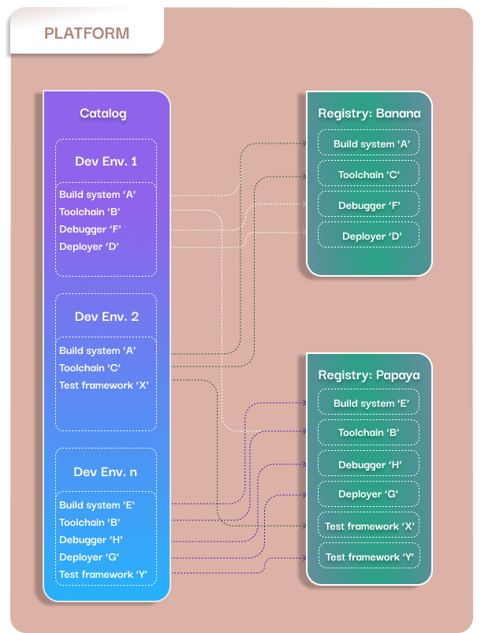

<h1 align="center">
    Containerized Development Environment Manager   for   Embedded Development
</h1>

<h3 align="center">
Manage your containerized Development Environments with ease
</h3>
 

    
    
    

 
<h1 align="center">🎉 We're participating in Hacktoberfest 2023! 🎉</h1>
 
 

Interested in participating in Hacktoberfest?  We extend a warm invitation, and you'll also have the chance to contribute to a greener globe! 🌱🌍
 
The first 50,000 participants to have their first PR/MR accepted will have a tree planted in their name through Tree Nation.

  ⭐️ If you're new to Hacktoberfest, you can learn more and register to participate [here](https://hacktoberfest.com/participation/). Registration is from **September 26th - October 31st**.
 

- Check out our [Contribution Guideline](https://github.com/axem-solutions/.github/blob/4bdc1be72b0a2c97da19408c59d6dd5d1845a469/CONTRIBUTING.md) for detailed instructions.
- Join our [Discord and engage with our community](https://discord.com/invite/2a67N75P), get answers to your challenges, learn more about embedded tooling, and stay updated on events and announcements.

 
 

## Overview

<strong>
<a href="https://www.axemsolutions.io/dem_doc/index.html">Documentation</a> • <a href="https://www.axemsolutions.io/tutorial/index.html">Tutorial</a> • 
<a href="https://github.com/axem-solutions/.github/blob/4bdc1be72b0a2c97da19408c59d6dd5d1845a469/CONTRIBUTING.md">Contribution guide</a> • 
<a href="https://github.com/axem-solutions/.github/blob/4bdc1be72b0a2c97da19408c59d6dd5d1845a469/SUPPORT.md">Support</a>
</strong>

The DEM is a command line tool that provides an easy, reproducible, and scalable way to set up 
Development Environments for embedded software development.
> The DEM can be used locally, but it is in alpha state, so expect major new features!

:star2: Contributors and early adopters are welcome! :star2:

## Concept
A Development Environment is a set of tools used for a development project (e.g. build system, 
debugger, toolchain, etc.).  The tools are separately packed into container images, which are stored 
in registries.

Each Development Environment has a descriptor. A descriptor indicates which tools are 
required in the project and the place their container images are stored. All descriptors are stored 
in the Development Environment Catalogs. The users can browse these catalogs, and list the available 
environments and their statuses.  
A Development Environment can be installed from its catalog by a simple dem command, which means 
that the required tool images get downloaded from the registries.

The registries, the catalogs, and the development infrastructure form a Development Platform.

The purpose of DEM is the easy management of this platform. The users can install available 
Development Environments or freely create their own from the tool images available in the registries 
or locally.

## Key features

- Create scalable, reliable, and reproducible containerized Development Environments
- Manage your containerized tools
- Install preconfigured Development Environments from catalogs
- Ensure that everyone in the team works with the same toolset
- Share Development Environments outside of your organization

## Prerequisites

To be able to use the DEM on your PC, you need to have the following software installed:

- Python 3.10+
- Docker Engine 24.0+

:information_source: Currently only the Linux operating system and the Docker Engine are supported.

## Installation

DEM is available in the [PyPI repository](https://pypi.org/project/axem-dem/). Install it with:

    pip install axem-dem

:information_source: The package name is axem-dem, but the command is `dem`.

## Quick start

### Install a preconfigured environment

List the available environments:

    dem list --all --env

You can get information about the Development Environment of your choice:

    dem info DEV_ENV_NAME

Installation of a Development Environment from a catalog can be done with a single command:

    dem pull DEV_ENV_NAME

### Create a new environment and add your own tools

Create separate container images for your tools. 
> There is no need for any specific configuration in your container images to be compatible with 
DEM.

From the new images and the ones available from the registries, you can create your new Development 
Environment:

    dem create DEV_ENV_NAME

This command will start a TUI where you can configure your new Development Environment.

For more detailed instructions please refer to the
[Documentation](https://www.axemsolutions.io/dem_doc/index.html)
