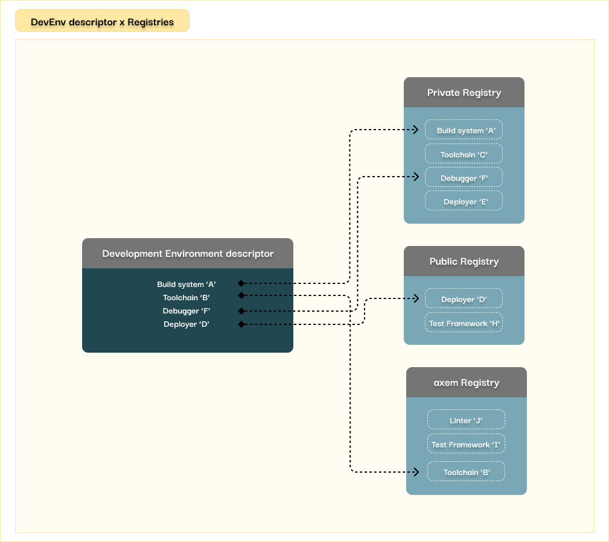
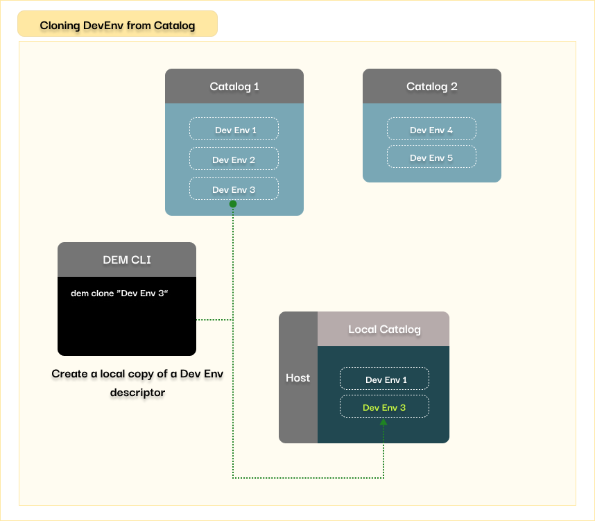

## What is a Development Environment?
A set of software tools used for a specific development project is called a **Development
Environment**. These tools can include the build system, debugger, test framework, and more.

## A Container Image
A container image is a set of **software components alongside its dependencies**, 
which can be run in a container.

## A Tool Container Image
The concept involves packaging the tools from a Development Environment into **dedicated images**,
 allowing them to **operate independently** and in isolation.

## Development Environment Descriptor
Each Development Environment has a descriptor. A descriptor, like a blueprint, indicates **which tools
are required in the project**, and the place their container images are stored.

## Container Engine
The container engine is responsible for **running the container images**. 
DEM utilizes the Docker Container Engine to run the tool images.

## Registry and Repository
A registry acts as a **storage for tool images**, allowing them to be stored without consuming space on a developer's computer. 
This storage facilitates easy sharing of images among collaborators, ensuring consistent tool usage across the project team.
When an image is uploaded to a registry, it triggers the creation of a repository. This repository manages the various versions of the image.

!!! Note

    An image **repository** stores the different versions of the same image.  
    An image **registry** is a collection of image repositories.

In the background, **DEM also uses registries** to store the tool images. To **list the currently 
available registries** use the `dem list-reg` command. 
You can add or delete registries using the dem add-reg and dem del-reg commands.

!!! Note

    DEM supports the [Docker Hub](https://docs.docker.com/docker-hub/) and 
    [Docker Registry](https://docs.docker.com/registry/)

    To request support for other registry types, start a discussion
    in our community through [Discord](https://discord.gg/3aHuJBNvrJ).

## Development Environment Catalogs
A catalog is a **collection of Development Environment descriptors**.  
DEM can manage multiple catalogs. To list the currently available ones use the `dem list-cat` 
command.  The `dem add-cat` and `dem del-cat` commands can be used to add or delete catalogs.

!!! success "axem default catalog"

    axem has its own catalog, which is available by default.

Users can browse these catalogs, and download a copy of the Development Environment descriptor 
to their local catalog.

## Development Platform
The registries, the catalogs, and the entire development infrastructure form the Development 
Platform. 

!!! example "Example Tutorial"

    Learn by doing! Try our [tutorial](https://www.axemsolutions.io/tutorial/index.html) 
    with a simple embedded project!
