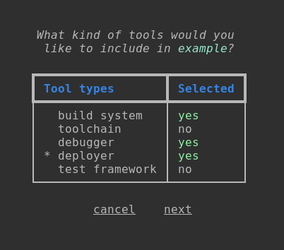
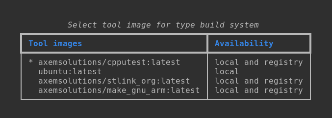

!!! warning

    Always put the input text into double quotation marks (""), if it contains whitespaces.

## **`dem list [OPTIONS]`**

List the Development Environments installed locally or available in the catalog.

Options:

- Level 1:
    - `--local` Scope is the local host.
    - `--all` Scope is the catalog.
- Level 2:
    - `--env` List the Development Environments.
    - `--tool` List the tool images.

!!! abstract "The following option combinations are supported:"

    `--local --env` -> List the local Development Environments.  
    `--all --env` -> List the catalog Development Environments.  
    `--local --tool` -> List the local tool images.  
    `--all --tool` -> List the tool images available in the registries.

---

# Development Environment management

## **`dem info DEV_ENV_NAME`**

Get information about the specified Development Environment.

Arguments:

`DEV_ENV_NAME` Name of the Development Environment to get info about. [required]

---

## **`dem pull DEV_ENV_NAME`**

Pull all the required containerized tools (which are not yet available on the host PC) from the
registry and install the Development Environment locally.

    If a Development Environment with the same name, but a different description has been already
    available on the host PC, it gets overwritten with the new one.
    If the same Development Environment is already installed, but the installation is not complete,
    the missing tool images are obtained from the registry.

Arguments:

`DEV_ENV_NAME` Name of the Development Environment to install. [required]

---

## **`dem create DEV_ENV_NAME`**

Create a new Development Environment.

Running this command will open up an interactive UI on the command line. Follow the steps below to
configure the new Environment.

1. First you need to select the tool types. You can navigate with the :material-arrow-up: and
:material-arrow-down: or :material-alpha-k: and :material-alpha-j: keys. Select the required
tool types with :material-keyboard-space:. Select next if you finished the selection.

    

2. Assign the required tool images for the selected types. You can navigate with the
:material-arrow-up: and :material-arrow-down: or :material-alpha-k: and :material-alpha-j: keys.
Select the required tool image and press :material-keyboard-return:.

    

Arguments:

`DEV_ENV_NAME` Name of the Development Environment to create. [required]

---

## **`dem clone DEV_ENV_NAME`

Clone a Development Environment descriptor from the catalogs. 

Only the Development Environment descriptor gets cloned, the required tool images are not pulled. To
pull the required tool images, use the `install` command.  
If a Development Environment with the same name has been already available on the host PC, the user
will be asked if they want to overwrite it or not.

Arguments:

`DEV_ENV_NAME` Name of the Development Environment, whose descriptor to clone. [required]

---

## **`dem rename DEV_ENV_NAME NEW_DEV_ENV_NAME`**

Rename the Development Environment.

Arguments:

`DEV_ENV_NAME`      Name of the Development Environment to rename. [required]
`NEW_DEV_ENV_NAME`  The new name.  [required]

---

## **`dem modify DEV_ENV_NAME`**

Modify the tool types and required tool images of an existing Development Environment.

1. The dem shows a list of the already selected tools. You can modify the selection. You can
navigate with the :material-arrow-up: and :material-arrow-down: or :material-alpha-k: and
:material-alpha-j: keys. Modify the required tool types with :material-keyboard-space:. Select next
when you're done with the selection.

    

2. Assign the required tool images for the selected types. You can navigate with the
:material-arrow-up: and :material-arrow-down: or :material-alpha-k: and :material-alpha-j: keys.
Select the required tool image and press :material-keyboard-return:.

    

Arguments:

`DEV_ENV_NAME` Name of the Development Environment to modify. [required]

---

## **`dem delete DEV_ENV_NAME`**

Delete the selected Development Environment. After the deletion, dem checks whether a tool image is
required or not by any of the remaining local Development Environments. In case the tool image is
not required anymore, the dem asks the user if they prefer to delete it or keep it.

Arguments:

`DEV_ENV_NAME` Name of the Development Environment to delete. [required]

---

## **`dem cp DEV_ENV_NAME NEW_DEV_ENV_NAME`**

Create a copy of an existing local Development Environment.

Arguments:

`DEV_ENV_NAME` Name of the Development Environment to copy. [required]

`NEW_DEV_ENV_NAME` Name of the New Development Environment. [required]

---

## **`dem run DEV_ENV_NAME *`**

:warning: Experimental feature!

Run a container in the context of a Development Environment.

This command works the same way as the `docker run`, but with some restrictions, and the first
argument is the name of the Development Environment.

:warning: The supported docker run options:  
`-p, --name, -v, --privileged, --rm, --name, -d`  
See the [Docker documentation](https://docs.docker.com/engine/reference/commandline/run/) for more
info.

Arguments:

`DEV_ENV_NAME` Name of the Development Environment. [required]

`*` Variable-length argument list that will be passed to the `docker run` command.

---

## **`dem export DEV_ENV_NAME [PATH_TO_EXPORT]`**

Export a Development Environment descriptor in JSON format to a text file. This file can be imported with the `load` command on another host. 

The way the file gets named can be set by the PATH_TO_EXPORT argument:

1. If it's not set, the file gets saved to the current directory with the name of the Development 
Environment and without extension.
2. If only a name is set, the file gets saved with that name to the current directory, optionally 
with the set extension.
3. If the argument is a directory path, the file gets saved there with the name of the Development 
Environment, without extension.
4. If the argument is a path with the file name, then the exported content gets saved into that file.
The extension can be set with the file name.

!!! Note

    The exported file only contains the Development Environment descriptor in JSON format. For a 
    successful import the DEM needs access to all the registries where the required images are 
    stored.

Arguments:

`DEV_ENV_NAME` The name of the Development Environment to export.

`[PATH_TO_EXPORT]` Where to save the exported descriptor in JSON format. If not set, the current 
directory will be used.

---

## **`dem load PATH_TO_DEV_ENV`**

Imports a Development Environment.

!!! Note

    The file to import only contains the Development Environment descriptor. For a successful import
    the DEM needs access to all the registries where the required images are stored.

Arguments:

`PATH_TO_DEV_ENV` Path of the JSON file to import. Can be an absolute path or a relative path to the 
current directory.

---

# Development Environment Catalog management

## **`dem list-cat`**

List the available catalogs.

---

## **`dem add-cat NAME URL`**

Add a new catalog.
You can name the catalog as you wish.
The URL must point to an HTTP(S) server where the Catalog JSON file is available.

Arguments:

`NAME` Name of the catalog to add. [required]

`URL` URL of the catalog file. [required]

---

## **`dem del-cat NAME`**

Delete a catalog.

Arguments:

`NAME` Name of the catalog to delete. [required]

---

# Registry management

## **`dem list-reg`**

List the available registries.

---

## **`dem add-reg NAME URL`**

Add a new registry.
The name of the registry is what you would normally use to pull an image.
Examples:

- If the full image tag is: repository/image:tag -> the name should be repository.
- If the full image tag is: 192.168.1.1:5000/image:tag -> the name should be 192.168.1.1:5000

The URL should point to the registry's API. For the Docker Hub https://registry.hub.docker.com, 
or it can be http://localhost:5000 for a self-hosted one.

Arguments:

`NAME` Name of the registry to add. [required]

`URL` API URL of the registry. [required]

---

## **`dem del-reg NAME`**

Delete a registry.

Arguments:

`NAME` Name of the registry to delete. [required]

## **`dem add-host NAME ADDRESS`**

Add a new host to the configuration.

Arguments:

`NAME` Name of the host. [required]

`ADDRESS` IP or hostname of the host. [required]

---