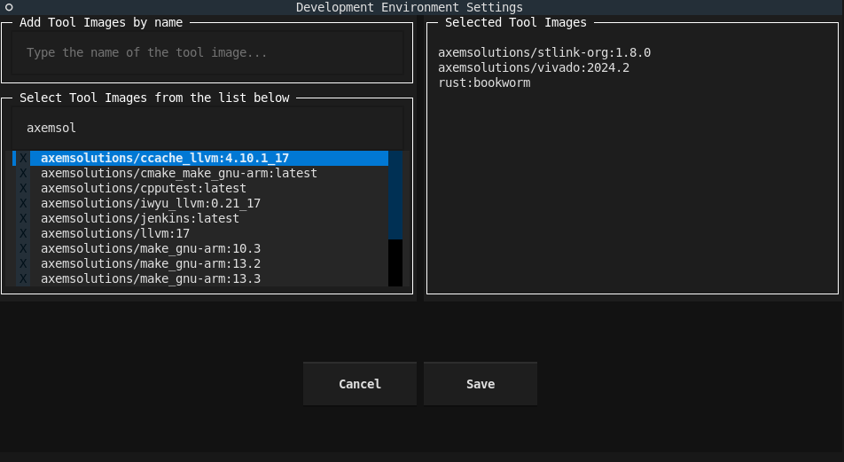

The commands are grouped by their functionality. The commands are listed in alphabetical order.  
The groupings are:

- Development Environment management
- Development Environment Catalog management
- Registry management
- Host management

# Development Environment management

## **`dem assign DEV_ENV_NAME, [PROJECT_PATH]`**

Assign a Development Environment to a project.

If the project already has a Development Environment assigned, the user will be asked if they want to
overwrite it or not.

Projects that have a Development Environment assigned, can be initialized with the `init` command.

Arguments:

`DEV_ENV_NAME` Name of the Development Environment to assign. [required]

`[PROJECT_PATH]` Path of the project to assign the Development Environment to. If not set, the current
working directory will be used.

---

## **`dem clone DEV_ENV_NAME`**

Clone a Development Environment descriptor from the catalogs. 

Only the Development Environment descriptor will be cloned, the required tool images won't be pulled.
If a Development Environment with the same name has been already available on the host PC, the user
will be asked if they want to overwrite it or not.

:information_source: After cloning, the Development Environment can be installed with the `install` command.

Arguments:

`DEV_ENV_NAME` Clone the descriptor of the Dev Env. [required]

---

## **`dem cp DEV_ENV_NAME NEW_DEV_ENV_NAME`**

Create a copy of an existing local Development Environment.

Arguments:

`DEV_ENV_NAME` Name of the Development Environment to copy. [required]

`NEW_DEV_ENV_NAME` Name of the New Development Environment. [required]

---

## **`dem create DEV_ENV_NAME`**

Create a new Development Environment descriptor and save it to the local descriptor storage (catalog).

Running this command will open up the Dev Env Settings Window:

The table on the left shows the available tool types. Select the ones you want to use in the 
Development Environment. You can navigate with the :material-arrow-up: and :material-arrow-down: or 
:material-alpha-k: and :material-alpha-j: keys. Move the cursor to the tool image you would like to 
select or deselect  and press the :material-keyboard-return:. 
On the right side, you can see the tool images that are selected.

When the Dev Env is ready, press :material-keyboard-return: on the `save` button.

!!! info 

    After creation, the Development Environment can be installed with the `install` command.

Arguments:

`DEV_ENV_NAME` Name of the Development Environment to create. [required]

---

## **`dem delete DEV_ENV_NAME`**

Delete the Dev Env descriptor from the local descriptor storage.
If the Dev Env is installed, the user will be asked whether they want to uninstall it. 

Arguments:

`DEV_ENV_NAME` Name of the Development Environment to delete. [required]

---

## **`dem export DEV_ENV_NAME [PATH_TO_EXPORT]`**

Export a Development Environment descriptor in JSON format to a text file. This file can be imported with the `load` command on another host. 

The way the file gets named can be set by the PATH_TO_EXPORT argument:

1. If it's not set, the file gets saved to the current directory with the name of the Development 
Environment and without extension.
2. If only a name is set, the file gets saved with that name to the current directory, optionally 
with the set extension.
3. If the argument is a directory path, the file gets saved there with the name of the Development 
Environment, without extension.
4. If the argument is a path with the file name, then the exported content gets saved into that file.
The extension can be set with the file name.

!!! Note

    The exported file only contains the Development Environment descriptor in JSON format. For a 
    successful import the DEM needs access to all the registries where the required images are 
    stored.

Arguments:

`DEV_ENV_NAME` The name of the Development Environment to export.

`[PATH_TO_EXPORT]` Where to save the exported descriptor in JSON format. If not set, the current 
directory will be used.

---

## **`dem import PATH_TO_DEV_ENV`**

Imports a Development Environment descriptor.

:information_source: After the import, the Development Environment can be installed with the `install` 
command.

!!! Note

    The file to import only contains the Development Environment descriptor. To install the Dev Env
    the DEM needs access to all the registries where the required images are stored.

Arguments:

`PATH_TO_DEV_ENV` Path of the JSON file to import. Can be an absolute path or a relative path to the 
current directory.

---

## **`dem info DEV_ENV_NAME [OPTIONS] [*CATALOG_NAMES]`**

Get information about the specified Development Environment available locally or in the catalogs.

`--cat`: DEM will search for the Dev Env in the catalogs and will print the details of the first
match. You can specifiy the catalogs' name to search in after this option. If no catalog is 
specified, all the available catalogs will be used. If the Dev Env is not found in the catalogs,
an error message will be printed.

:information_source: Autocomplete only works with the locally avialable Dev Envs.

Arguments:

`DEV_ENV_NAME` Name of the Development Environment to get info about. [required]
`[OPTIONS]` --cat: Search in the catalogs. [optional]
`[*CATALOG_NAMES]` Catalogs to search in. [optional

Examples:

- `dem info dev_env_name` Get information about the locally available Development Environment.
- `dem info dev_env_name --cat` Get information about the Development Environment from the catalogs.
- `dem info dev_env_name --cat catalog1 catalog2` Get information about the Development Environment from the catalog1 and catalog2.

---

## **`dem init [PROJECT_PATH]`**

Initialize a project with the assigned Development Environment.

:information_source: After the initialization, the Development Environment can be installed with the `install` 
command.

Arguments:

`PROJECT_PATH` Path of the project to initialize. If not set, the current working directory will be
used.

---

## **`dem install DEV_ENV_NAME`**

Install the selected Development Environment. DEM pulls all the required containerized tools (which 
are not yet available on the host PC) from the registry and install the Development Environment 
locally. If the same Development Environment is already installed, but the installation is not 
complete, the missing tool images get obtained from the registry.

Arguments:

`DEV_ENV_NAME` Name of the Development Environment to install. [required]

---

## **`dem list [OPTIONS] [*CATALOG_NAMES]`**

List the locally available Dev Envs.

Options:

`--cat`: List the available Dev Envs from the catalogs. Specify the catalogs' name to list the Dev 
Envs from. More then one catalog can be specified. If no catalog is specified, all the available
catalogs will be used.

Arguments:

`[OPTIONS]` --cat: List the Dev Envs from the catalogs. [optional]
`[*CATALOG_NAMES]` Catalogs to list the Dev Envs from. [optional]

Examples:

- `dem list` List the locally available Dev Envs.
- `dem list --cat` List all the Dev Envs from all the available catalogs.
- `dem list --cat catalog1 catalog2` List all the Dev Envs from the catalog1 and catalog2.

---

## **`dem list-tools [OPTIONS] [*REGISTRY_NAMES]`**

List the available tools.

Options:

`--reg`: List the available tools from the registries. Specify the registries' name to list the 
tools from. More then one registry can be specified. If no registry is specified, all the available
registries will be used.

Arguments:

`[OPTIONS]` --reg: List the tools from the registries. [optional
`[*REGISTRY_NAMES]` Registries to list the tools from. [optional]

Examples:

- `dem list-tools` List the locally available tools.
- `dem list-tools --reg` List all the tools from all the available registries.
- `dem list-tools --reg registry1 registry2` List all the tools from the registry1 and registry2.

---

## **`dem modify DEV_ENV_NAME`**

Modify a Development Environment descriptor available from the local descriptor storage (catalog).

Running this command will open up the Dev Env Settings Window, prefilled with the current selection:

The table on the left shows the available tool types. Select the ones you want to use in the 
Development Environment. You can navigate with the :material-arrow-up: and :material-arrow-down: or 
:material-alpha-k: and :material-alpha-j: keys. Move the cursor to the tool image you would like to 
select or deselect  and press the :material-keyboard-return:. 
On the right side, you can see the tool images that are selected.

When the Dev Env is ready, press :material-keyboard-return: on the `save` button.

!!! info 

    After the modification, the Development Environment can be installed with the `install` command.

Arguments:

`DEV_ENV_NAME` Name of the Development Environment to modify. [required]  

---

## **`dem rename DEV_ENV_NAME NEW_DEV_ENV_NAME`**

Rename the Development Environment.

Arguments:

`DEV_ENV_NAME`      Name of the Development Environment to rename. [required]
`NEW_DEV_ENV_NAME`  The new name.  [required]

---

## **`dem run DEV_ENV_NAME *`**

:warning: Experimental feature!

Run a container in the context of a Development Environment.

This command works the same way as the `docker run`, but with some restrictions, and the first
argument is the name of the Development Environment.

:warning: The supported docker run options:  
`-p, --name, -v, --privileged, --rm, --name, -d`  
See the [Docker documentation](https://docs.docker.com/engine/reference/commandline/run/) for more
info.

Arguments:

`DEV_ENV_NAME` Name of the Development Environment. [required]

`*` Variable-length argument list that will be passed to the `docker run` command.

---

## **`dem uninstall DEV_ENV_NAME`**

Uninstall the selected Development Environment. Sets the installed flag to False. DEM checks whether 
a tool image is required or not by any of the remaining installed local Development Environments. In 
case the tool image is not required anymore, the DEM tries to delete it. 

Arguments:

`DEV_ENV_NAME` Name of the Development Environment to uninstall. [required]

---

# Development Environment Catalog management

## **`dem add-cat NAME URL`**

Add a new catalog.
You can name the catalog as you wish.
The URL must point to an HTTP(S) server where the Catalog JSON file is available.

Arguments:

`NAME` Name of the catalog to add. [required]

`URL` URL of the catalog file. [required]

---

## **`dem del-cat NAME`**

Delete a catalog.

Arguments:

`NAME` Name of the catalog to delete. [required]

---

## **`dem list-cat`**

List the available catalogs.

---

# Registry management

## **`dem add-reg NAME URL`**

Add a new registry.
The name of the registry is what you would normally use to pull an image.
Examples:

- If the full image tag is: repository/image:tag -> the name should be repository.
- If the full image tag is: 192.168.1.1:5000/image:tag -> the name should be 192.168.1.1:5000

The URL should point to the registry's API. For the Docker Hub https://registry.hub.docker.com, 
or it can be http://localhost:5000 for a self-hosted one.

Arguments:

`NAME` Name of the registry to add. [required]

`URL` API URL of the registry. [required]

---

## **`dem del-reg NAME`**

Delete a registry.

Arguments:

`NAME` Name of the registry to delete. [required]

## **`dem list-reg`**

List the available registries.

---

# Host management

## **`dem add-host NAME ADDRESS`**

Add a new host to the configuration.

Arguments:

`NAME` Name of the host. [required]

`ADDRESS` IP or hostname of the host. [required]

---

## **`dem del-host NAME`**

Delete a host from the config file.

Arguments:

`NAME` Name of the host to delete. [required]

## **`dem list-host`**

List the available hosts from the config file.

---
