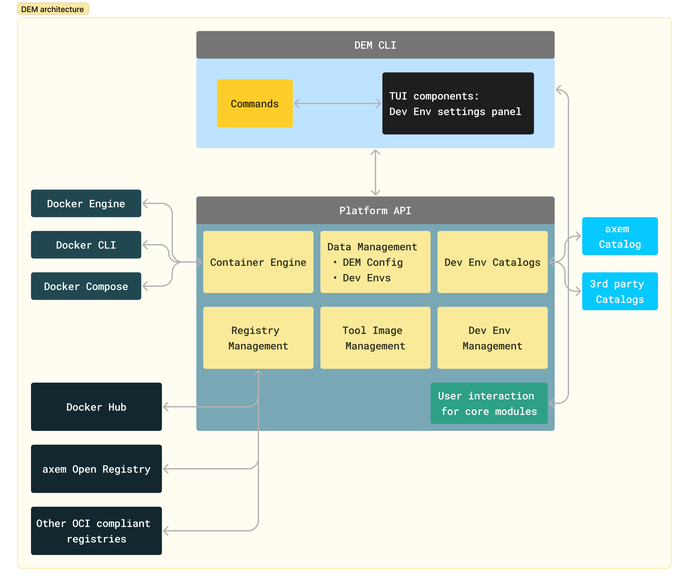

## Architectural Overview

This chapter contains the technical documentation for the design.

The Development Environment Manager (DEM) provides an abstraction layer for the Development 
Platform, which encompasses a collection of available resources, such as registries, catalogs, 
container engines, and more. The modules that compose the platform form the core of the DEM.

The DEM implements commands that can interact with the platform. These commands can be executed 
using the command line interface (CLI). Additionally, some commands utilize a Text-based User 
Interface (TUI) that can be presented on the user's terminal.

{: .center}

The CLI can communicate with the platform in two ways:

1. Over the Platform API, which can be achieved by instantiating the DevEnvLocalSetup class.
2. By registering a UserOutput class, which is used by the core modules to interact with the user.

The platform offers the following resources:

1. **Tool images** (`tool_images`): You can use this resource to access tool images from both your 
local storage and the registries.
2. **Container Engine** (`container_engine`): This resource covers various operations related to the 
container engine, including:
    - Pulling images
    - Running containers
    - Removing images
    - Searching for images
3. **Registries** (`registries`): This resource contains information about the available registries.
You can perform actions such as:
    - Adding or deleting registries
    - Listing the images stored in a registry
    - Pulling an image from a registry
4. **Local Development Environments** (`local_dev_envs`):  This resource provides a list of local 
Development Environments. You can obtain information about a specific Development Environment using 
this resource.
5. **Development Environment Catalogs** (`dev_env_catalogs`): This resource deals with the available 
catalogs. You can perform the following actions:
    - Adding or deleting catalogs
    - Listing the Development Environments within a catalog
    - Cloning a Development Environment descriptor from a catalog 

## Core Components

<figure markdown>
  
  <figcaption>The dependency graph of the core modules</figcaption>
</figure>

As shown in the diagram, the platform module depends on the rest of the resources. This concept 
allows for the creation of a unified interface for all internal resources.

The relationships between classes in the core modules can be observed in the 
[Core Class Diagram](wp-content/core_class_diagram.png).

## Third-party Modules

### **Typer**
This module is used to create a framework for the CLI commands. You can add a new command by 
extending the list of functions in the main.py file and applying the `@typer_cli.command()` 
decorator.

### **Rich**
Rich is a Python library used for formatting text with colors and styles, displaying advanced 
content like tables, markdown, and syntax-highlighted code.  
DEM employs this module to present information to the user in the command line.

### **Requests**
Requests is an HTTP library for Python.

### **Readchar**
This module can be used to capture character inputs. In cases where the Rich module is not suitable, 
Readchar is a useful tool for obtaining user input. 

For instance, when the Rich module occupies the entire terminal for a TUI panel, Readchar can be 
used to capture navigation input by reading individual characters.

### **Docker**
Docker is used to communicate directly with the Docker Engine. (The Docker CLI is not utilized.)

## Command setup

The commands can interact with the Platform by instantiating the DevEnvLocalSetup class, which 
should provide all the necessary functionality from the core modules.

For a detailed description of the functionality of each command, please refer to the Commands 
chapter. In this section, we provide flowcharts to describe the execution logic.

- [add-cat](wp-content/flowcharts/add-cat.png)
- [add-reg](wp-content/flowcharts/add-reg.png)
- [create](wp-content/flowcharts/create.png)
- [delete](wp-content/flowcharts/delete.png)
- [del-reg](wp-content/flowcharts/del-reg.png)
- [info](wp-content/flowcharts/info.png)
- [init (without assigned dev env)](wp-content/flowcharts/init_without_assigned_dev_env.png)
- [init (with assigned dev env)](wp-content/flowcharts/init_with_assigned_dev_env.png)
- [list](wp-content/flowcharts/list.png)
- [modify](wp-content/flowcharts/modify.png)
- [uninstall](wp-content/flowcharts/uninstall.png)
- [add-host](wp-content/flowcharts/add-host.png)
- [clone](wp-content/flowcharts/clone.png)
- [del-cat](wp-content/flowcharts/del-cat.png)
- [del-host](wp-content/flowcharts/del-host.png)
- [export](wp-content/flowcharts/export.png)
- [install](wp-content/flowcharts/install.png)
- [load](wp-content/flowcharts/load.png)
- [rename](wp-content/flowcharts/rename.png)