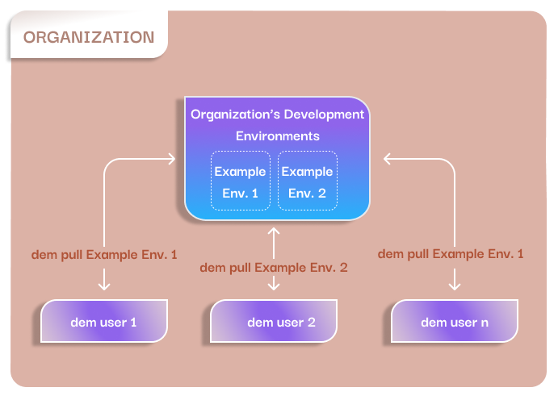

## What is a Development Environment?
A set of software tools used for a development project is called a **Development Environment**.

## Tool types
Currently, the following tool types are supported:

    - Build system
    - Toolchain
    - Debugger
    - Deployer
    - Test framework
    - CI/CD server

When creating a new Development Environment the user can select any of the above types and then 
assign the required tools to them. 

!!! warning

    In the v0.3.0 we are going to change this behavior and let the users to define their own tool 
    types.

## Tool images
To put it simply, a container image is a set of software components alongside its dependencies, 
which can be run in a container. The idea is to build the tools from a Development Environment into 
their own images, so they can run isolatedly.

Tool images can be put into a storage called a registry. The registry can store the images, so they
don't take up space. Images from a registry can be easily shared with others, which helps to ensure
that everybody working on the same project uses the exact same tools.

!!! Note

    An image repository stores the different versions of the same image.
    An image registry is a collection of image repositories.

The DEM also uses registries in the background to store the tool images. To list the currently 
available registries use the `dem list-reg` command. The `dem add-reg` and `dem del-reg` commands 
can be used to add or delete registries.

!!! Note

    The DEM supports the [Docker Hub](https://docs.docker.com/docker-hub/) and 
    [Docker Registry](https://docs.docker.com/registry/)

    If you'd like to request support for other registry types, please create a 
    [new descussion](https://github.com/axem-solutions/dem/discussions/categories/regsitry).

## Development Environment Catalogs
A catalog is a collection of Development Environments available to install. The DEM can handle 
multiple catalogs. To list the currently available ones use the `dem list-cat` command. The 
`dem add-cat` and `dem del-cat` commands can be used to add or delete catalogs.

!!! Note

    By default, the DEM has the axem registry registered. 

## Getting a Development Environment
There are three ways to get a Development Environment: 
- install one from a Catalog 
- create a new one locally
- load an exported Development Environment descriptor

### Installing from a catalog
An organization can create a Development Environment Catalog and share it with its members. This 
**guarantees** that each and every member uses the **same toolset** in the **same environment**. 

{: .center}

The members can list the available Development Environments in the organization's catalog with the 
following command:  
`dem list --all --env`

Use the `dem pull` command to install the selected Development Environment.

1. First the DEM installs the Development Environment descriptor.
2. Then downloads the necessary tool images, which are not yet available on the host PC.

See the [`dem pull`](commands.md#dem-pull-dev_env_name) command for more details.

### Creating a new Development Environment locally
DEM provides a TUI for creating a new Development Environment that can be started with the 
`dem create` command.

See the [`dem create`](commands.md#dem-create-dev_env_name) command for more details.

### Load a Development Environment
A locally already available Development Environment can be exported in JSON format with the 
`dem export` command. The exported JSON describes the required tool images and the location of the 
registries where they stores. This file can be shared and on another PC can be imported with the 
`dem load` command. After the DEM loaded the descriptor, it will pull the required tool images.

See the [`dem export`](commands.md#dem-export-dev_env_name) and 
[`dem load`](commands.md#dem-load-dev_env_name) commands for more details.